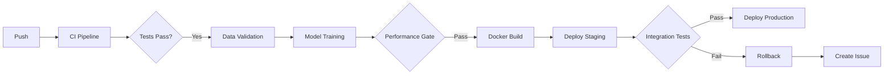

# ML CI/CD Pipeline


> GitHub Actions workflows automating the full ML lifecycle: testing, data validation, training, evaluation, deployment, and rollback.

## Features

- Automated CI with linting (ruff), testing (pytest), and coverage gates (80%+)
- Data validation pipeline with schema, distribution, and missing-value checks
- Model training with scikit-learn, performance gates, and production comparison
- Versioned model artifacts via GitHub Releases
- Training cache to skip redundant retraining
- Docker-based deployment to GitHub Container Registry
- Automated rollback on deployment failures with issue alerts
- Multi-environment configs (dev, staging, prod) with escalating thresholds
- Dynamic badges and metrics history tracking with trend visualization

## Architecture



## Quick Start

```bash
# Clone and install
git clone git@github.com:KarasiewiczStephane/ml-cicd-pipeline.git
cd ml-cicd-pipeline
make install

# Run the full ML pipeline (loads Iris data, trains, evaluates, exports sample CSV)
make run

# Launch the Streamlit dashboard (model registry, accuracy trends, pipeline timeline)
make dashboard
```

The pipeline loads the Iris dataset via scikit-learn at runtime, trains a RandomForest classifier, evaluates metrics, and exports a sample CSV to `data/sample/iris.csv`. No manual data preparation is needed.

### Other Commands

```bash
make test       # Run pytest with coverage
make lint       # Lint and format with ruff
make coverage   # Enforce 80% coverage gate
make docker     # Build and run the production container on port 8000
```

## Dashboard

The Streamlit dashboard (`src/dashboard/app.py`) visualizes the CI/CD pipeline status:

- **Summary metrics** — current model version, accuracy, total versions, best accuracy
- **Performance trend** — accuracy and F1-score over time
- **Model registry history** — versioned model table with status (production/archived)
- **Pipeline run timeline** — Gantt-style view of pipeline stages
- **Performance gate results** — pass/fail indicators per run

The dashboard ships with built-in demo data and can optionally display real data from the model registry and metrics tracker (toggle in the sidebar).

```bash
make dashboard   # Opens at http://localhost:8501
```

## Workflows

| Workflow | Trigger | Purpose |
|----------|---------|---------|
| [CI](.github/workflows/ci.yml) | Push / PR | Lint, test, coverage gate (Python 3.10-3.12) |
| [Data Validation](.github/workflows/data-validation.yml) | Data changes / Manual | Schema, distribution, quality checks |
| [Training](.github/workflows/train.yml) | Manual / Schedule / Data change | Train, evaluate, performance gate, release |
| [Deploy](.github/workflows/deploy.yml) | After training | Build Docker, deploy staging/prod, rollback |
| [Badge Update](.github/workflows/badge-update.yml) | After CI / Training | Update README badges |

## Project Structure

```
ml-cicd-pipeline/
├── .github/workflows/       # CI/CD pipeline definitions
│   ├── ci.yml               # Lint, test, coverage
│   ├── data-validation.yml  # Data quality checks
│   ├── train.yml            # Model training + evaluation
│   ├── deploy.yml           # Docker build, staging, production
│   └── badge-update.yml     # Dynamic badge updates
├── src/
│   ├── dashboard/
│   │   └── app.py           # Streamlit dashboard (registry, trends, gates)
│   ├── data/
│   │   ├── loader.py        # Iris dataset loading and splitting
│   │   └── validator.py     # Schema, distribution, quality validation
│   ├── models/
│   │   ├── train.py         # sklearn pipeline training
│   │   ├── evaluate.py      # Metrics computation and reporting
│   │   └── registry.py      # Production model registry + perf gate
│   ├── deploy/
│   │   └── health_check.py  # Deployment health verification
│   ├── utils/
│   │   ├── config.py        # YAML config loader (multi-env)
│   │   ├── cache.py         # Training cache (content hashing)
│   │   ├── badge_generator.py   # shields.io badge URLs
│   │   ├── metrics_tracker.py   # Metrics history + trend charts
│   │   ├── release_notes.py     # Model release notes generator
│   │   └── deployment_tracker.py # Deployment version history
│   └── main.py              # Pipeline orchestration entry point
├── tests/
│   ├── unit/                # Unit tests for all modules
│   └── integration/         # End-to-end deployment tests
├── configs/
│   ├── config.yaml          # Default configuration
│   ├── dev.yaml             # Development (threshold: 0.80)
│   ├── staging.yaml         # Staging (threshold: 0.85)
│   └── prod.yaml            # Production (threshold: 0.90)
├── Dockerfile               # Production container with HEALTHCHECK
├── Makefile                 # Dev commands (install, test, lint, run, dashboard, docker)
├── pyproject.toml           # Ruff + pytest config
├── requirements.txt         # Python dependencies
└── .pre-commit-config.yaml  # Pre-commit hooks (ruff, whitespace)
```

## Environment Configuration

Each environment has its own YAML config with appropriate thresholds:

| Environment | Accuracy Threshold | Debug | Log Level |
|-------------|-------------------|-------|-----------|
| `dev`       | 0.80              | true  | DEBUG     |
| `staging`   | 0.85              | false | INFO      |
| `prod`      | 0.90              | false | WARNING   |

Set the environment via the `ENVIRONMENT` variable:

```bash
ENVIRONMENT=staging python -m src.main
```

## How It Works

1. **CI Pipeline** runs on every push: ruff linting, pytest with coverage gate at 80%, matrix testing across Python 3.10/3.11/3.12
2. **Data Validation** checks schema, missing values, row counts, and distribution drift (KS test)
3. **Training Pipeline** trains a RandomForest classifier on the Iris dataset, evaluates metrics, and compares against the production model
4. **Performance Gate** blocks promotion if accuracy drops below the threshold or regresses vs. production
5. **Deployment** builds a Docker image, pushes to GHCR, tests in staging, then promotes to production
6. **Rollback** automatically reverts to the previous image and creates a GitHub issue if staging tests fail
7. **Metrics Tracking** appends metrics to a history file and generates trend charts

## Troubleshooting

**Tests failing locally?**
```bash
pip install -r requirements.txt
pytest tests/ -v --tb=long
```

**Pre-commit hooks failing?**
```bash
pre-commit install
pre-commit run --all-files
```

**Need to retrain the model?**
```bash
make run   # Runs the full pipeline: load data, train, evaluate, export sample
```

## License

MIT
